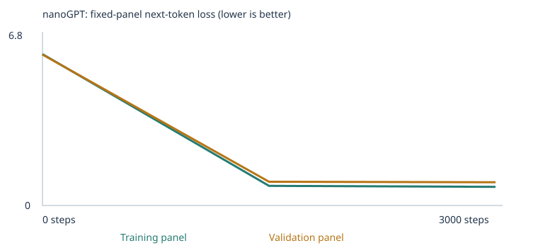
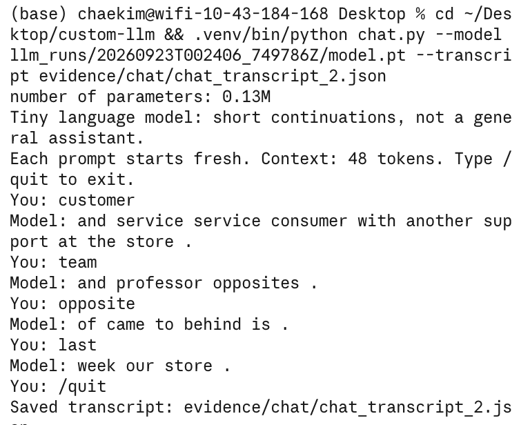

# My Custom LLM Experiment (MBA 290T, Assignment 3)

A tiny word-level language model: Karpathy's **nanoGPT** (2 blocks, 4 heads,
64-number embeddings, 48-token context), trained from scratch on CPU. I ran two
experiments with identical settings: the supplied **starter corpus**, then the
starter corpus plus my own teaching files for **grammar, opposites, and spatial
relations**. I ran the fixed 48-case language eval suite before and after training
in both experiments. This model continues short sentences; it is not a chatbot.

| | Experiment 1: starter | Experiment 2: expanded |
|---|---|---|
| Executed notebook | [custom_llm_executed.ipynb](evidence/experiment1_starter/custom_llm_executed.ipynb) | [custom_llm_executed.ipynb](evidence/experiment2_expanded/custom_llm_executed.ipynb) |
| Run ID | `20260922T234208_948785Z` | `20260923T002406_749786Z` |
| Full run folder | [evidence/experiment1_starter/run](evidence/experiment1_starter/run) | [evidence/experiment2_expanded/run](evidence/experiment2_expanded/run) |
| Results ZIP | [ZIP](evidence/experiment1_starter/20260922T234208_948785Z.zip) | [ZIP](evidence/experiment2_expanded/20260923T002406_749786Z.zip) |

## 1. Corpus, sources, and permissions

- **Starter corpus:** the notebook's synthetic classroom sentences (`CORPUS = "classroom"`).
  Before splitting, 160 generated sentences containing an eval prefix were withheld
  ([eval_separation.json](evidence/experiment1_starter/run/eval_separation.json)).
- **My additions (Experiment 2 only):** three plain-text files in `corpus/`, written for
  this assignment. Teaching files were drafted with Claude from the category names and
  per-category unknown-word counts, not the eval prompts or answers. Words from the public
  examples in the brief were excluded. The notebook's leakage check flagged three lines,
  which I deleted. I read the extension results only after the corpus was final. I reviewed
  every file. I have permission to share them; they contain no personal or confidential data.

| File | Passages | What it teaches |
|---|---|---|
| [grammar_tense_and_agreement.txt](corpus/grammar_tense_and_agreement.txt) | 137 | 30 verbs in four forms (paint / paints / painted / painting), time words that signal tense, singular vs. plural agreement |
| [opposites_in_context.txt](corpus/opposites_in_context.txt) | 159 | ~33 opposite pairs (temperature, size, sound, texture, amount, time) in several frames: contrast, "X and Y are opposites", "Y is the opposite of X", "the opposite of X is Y" |
| [spatial_relations.txt](corpus/spatial_relations.txt) | 59 | reversed relations inside one sentence: above/below, over/under, left/right, in front/behind, higher/lower, north/south |

- **355 new unique passages**, no warnings, no duplicates
  ([corpus_manifest.json](evidence/experiment2_expanded/run/corpus_manifest.json)).
- **No PDFs were used**, so there was no PDF extraction to check. All files are UTF-8 `.txt`.
- **Design choices** (details in section 7):
  - I used a small fixed cast of names and objects, so the vocabulary stays under the 509-type cap.
  - Each pattern stays inside one sentence, because the notebook splits training text at every period.
  - I excluded words from the examples published in the brief and the eval README (walk/walked, empty/full, lamp/desk, ava/ella/finn).

## 2. My three choices and prediction

- **Corpus:** starter first, then starter + the three files above. Nothing else changed.
- **Training steps: 3,000.** That is enough practice for a model this small to learn the sentence
  patterns; many more steps would raise the risk of memorizing training sentences.
  One step = one batch of 32 passages and one weight update, not a full pass
  (3,000 steps ≈ 23 passes over the 4,132 starter training passages).
- **Learning rate: 0.001.** That is large enough to make progress within 3,000 steps and small enough
  to avoid overshooting. The notebook warms the rate up over the first 100 steps and then
  cosine-decays it to 10% of the peak.

**What I predicted before each run** (full text in cell 2 of each executed notebook):

| | Prediction | Observed |
|---|---|---|
| Exp 1 loss | train ~0.5, val ~0.8, gap < 0.3 | train 0.678, val 0.706, gap 0.028 |
| Exp 1 samples | halfway: fragments; final: recombined templates | halfway samples were already complete sentences; every final sample exists in the corpus word for word, and 2 were validation sentences never trained on |
| Exp 1 evals | familiar 13/16, new wording 5/8, extension 0/24 | 16/16, 4/8, 0/24 |
| Exp 1 `customer` neighbors | patient, client, student, surgeon (same slot, other domains) | shopper, client, buyer, subscriber, consumer (same slot *and* same domain) |
| Exp 2 evals | 1 of 2 new scorable cases right; familiar holds; new wording 3–5 | 2 of 2 right (one was already right before training); 16/16; 7/8 |
| Exp 2 loss | higher than Exp 1, gap widens | train 0.762, val 0.949, gap 0.186 |

I was wrong about speed. I expected messy halfway samples, but the single-batch loss was
already 0.76 at step 500, the panel loss was 0.68 by step 1,500, and the sentences were
already clean at step 1,500. The corpus is narrow, so there wasn't much left to learn.
Familiar prompts beat my guess (16/16 vs. 13/16). New wording landed at 4/8, but most of
those were coin flips between near-zero probabilities, so I don't count that as learning.
For customer, I guessed role nouns like patient and client. I got shopper, buyer, and
consumer. In this corpus, shopping people only show up in shopping sentences, so "same
slot" and "same meaning" end up being the same thing.

For Experiment 2, I predicted 1 of 2 new extension cases right, starter scores holding,
and higher loss. Actual: 2 of 2, but the spatial case was already right before training,
by chance. Familiar 16/16, new wording 7/8, loss higher (0.762 / 0.949 vs. 0.678 / 0.706).
I missed new wording because I expected random flips. Instead, the correct choices gained
10–50× relative to the others, though most still stayed under 1% probability. With one run
and one seed, I can't tell whether that came from the new data or from chance.

## 3. My runs

| | Experiment 1 | Experiment 2 |
|---|---|---|
| Completed steps | 3,000 / 3,000, not interrupted | 3,000 / 3,000, not interrupted |
| Training time | 14.1 s | 12.4 s |
| Hardware | Apple M3 Pro (18 GB), macOS 15.7.4, CPU only, PyTorch 2.14.0, Python 3.11 | same |
| Parameters | 111,872 | 133,952 (larger embedding table) |
| Vocabulary | 136 (133 words + `<BOS>` `<EOS>` `<UNK>`) | 481 (478 + 3); 0 types dropped by the 509 cap |
| Unique passages / split | 4,592 → 4,132 train / 460 validation | 4,947 → 4,452 train / 495 validation |
| Unknown-token rate, train / held-out | 0.00% / 0.00% | 0.00% / 0.42% |
| Settings | [config.json](evidence/experiment1_starter/run/config.json), [training_summary.json](evidence/experiment1_starter/run/training_summary.json) | [config.json](evidence/experiment2_expanded/run/config.json), [training_summary.json](evidence/experiment2_expanded/run/training_summary.json) |
| Vocabulary report | [vocabulary_report.json](evidence/experiment1_starter/run/vocabulary_report.json) | [vocabulary_report.json](evidence/experiment2_expanded/run/vocabulary_report.json) |

- The only earlier run was a 10-step setup smoke test, which is not part of this submission.
- **Why the Exp 2 held-out unknown-token rate is 0.42%:** 23 of my words appear in only one
  sentence, and that sentence landed in the 10% validation split (e.g. *swam, wrote, built,
  kicked, planted*). The model never trained on them.
- **What the split can test:** it is by passage, not by source file, and held-out sentences
  share templates with training. So validation loss tests recombining familiar templates,
  not generalization to new kinds of text.

**What stayed fixed, what changed:**
- **Fixed across both experiments:** seed 42, model size, batch size, steps, learning rate,
  the 48-case eval suite (hash `1d7c503f…`), and the eval generation settings (seed 2026,
  temperature 0.8, 24 tokens).
- **Changed:** only the files in `corpus/`. That also changed the vocabulary, the split, and
  the 20+20 loss panels.
- **Changed only at inference:** temperature, and the chat and eval prompts. None of these update weights.

## 4. Evidence: samples and loss

**Samples** (same seed and settings at every checkpoint; files:
[Exp 1](evidence/experiment1_starter/run/samples), [Exp 2](evidence/experiment2_expanded/run/samples)):

| Step | Experiment 1 | Experiment 2 |
|---|---|---|
| 0 | (all 4 garbled lines below) | (all 4 garbled lines below) |
| 1,500 | `our school has a question about the new educator and lesson .` · `a review of risk helped us understand the different deposit .` · `we learned about the important website during a discussion of data .` · `our school has a question about the different instructor and course .` | `the important deposit was mentioned in the payment report yesterday .` · `our store has a question about the different consumer and support .` · `a review of care helped us understand the different nurse .` · `today the kitchen focused on fruit and the local pear .` |
| 3,000 | `our school has a question about the new educator and lesson .` · `a review of risk helped us understand the different deposit .` · `the report about the nurse explains the health in detail .` · `the consumer compared the offering after checking the price .` | `the important deposit was mentioned in the payment report yesterday .` · `our store has a question about the different consumer and support .` · `a review of care helped us understand the different nurse .` · `the different website was mentioned in the code report yesterday .` |

Step-0 samples, complete (untrained, same seed):

```text
Experiment 1
pear professor bond doctor course harvest team physician journey checking buyer delivery traffic report the lecturer item offering and system <UNK> taste recommended mentioned bus question customer at mortgage nurse in instructor
kitchen purchase journey product question discussion journey service . nurse local
compared and purchase update mortgage question loan taste in market treatment learned another item bicycle product bicycle focused data and dentist recommended mango apple taxi bicycle delivery peach quality update student lesson
important hospital juice patient return recommended deposit tutor returned understand kitchen student design ordered hospital treatment important package traffic with yesterday investment important of mentioned store ordered mortgage nurse shopper the station

Experiment 2
climbing look thin climbing cup brand in playing difficult mango big dirty , cooked stood program thick orange south laughs up cats summer sad sweet next system my water drifted left customer
report security when boat top thick then service cakes summer bright bike play order care bridge checking laugh hard chair new risk purchase planting fast silent cook taste few question expensive explains
cooked rough hangs visited learned game system packs different rolled wash offering felt tight left quality new climb lies running weekends stayed shallow packs morning sun market bake shopper route family on
writes calls ball priya website jump look laughed cleans run product usually low support bond friend visit truck plate plate omar car first truck weekends thin painting deep help under path each
```

**Visible change:** from random words to complete template sentences by step 1,500, with
little change after that. In Experiment 1, all 8 halfway and final sentences exist word for word in the
corpus, and 2 of them are validation passages the model never trained on. In Experiment 2,
no sample uses my new material; the new files are only ~7% of the training passages.

Step 0 was word soup. By step 1,500 it wrote full sentences. From 1,500 to 3,000, two
samples stayed identical and two changed to other template sentences. There's no quality
difference, which matches the flat loss. Extra training didn't buy anything.

**Loss** (fixed panels: **20 training and 20 validation passages**, mean over
non-padding next-token targets; these are small estimates, not full-corpus measurements).
This is every measured panel value ([Exp 1 history.json](evidence/experiment1_starter/run/history.json),
[Exp 2 history.json](evidence/experiment2_expanded/run/history.json)):

| Experiment | Step | Training loss | Validation loss |
|---|---|---|---|
| 1: starter | 0 | 4.926 | 4.928 |
| 1: starter | 1,500 | 0.682 | 0.718 |
| 1: starter | 3,000 | 0.678 | 0.706 |
| 2: expanded | 0 | 6.187 | 6.167 |
| 2: expanded | 1,500 | 0.801 | 0.970 |
| 2: expanded | 3,000 | 0.762 | 0.949 |

Experiment 1 curves:


Experiment 2 curves:



- Step-0 loss is about ln(vocabulary size): ln 136 ≈ 4.91, ln 481 ≈ 6.18. That is a uniform guess.
- Losses from different corpora and vocabularies are not directly comparable.
- The notebook also printed single-batch losses (Exp 1: 0.761 / 0.717 / 0.692 / 0.701 at
  steps 500 / 1,000 / 2,000 / 2,500). These come from random batches, not the fixed panels.

## 5. Evidence: token → ID → vector → probability → gradient → update

Files: [tokenization.json](evidence/experiment1_starter/run/tokenization.json),
[inspection.json](evidence/experiment1_starter/run/inspection.json) (Experiment 1).

- **Text → tokens → IDs:** `today the school focused on lesson and the local professor .`
  → `['today', 'the', 'school', 'focused', 'on', 'lesson', 'and', 'the', 'local', 'professor', '.']`
  → `[1, 121, 118, 101, 42, 74, 61, 7, 118, 63, 88, 3, 2]` (with `<BOS>` = 1 and `<EOS>` = 2).
- **One word:** `customer` → **ID 28** → a row of 64 numbers in the embedding table.
  - Before training, first 5 of 64: `[-0.0576, -0.0048, 0.0426, 0.0193, 0.0156]`
  - After training, first 5 of 64: `[0.0366, -0.0182, 0.1330, 0.1060, 0.0630]`
  - Full vectors are in `inspection.json`. Length grew 0.175 → 0.673; cosine similarity before vs. after = 0.197.
  - Nearest neighbors after training (cosine): shopper 0.98, client 0.98, buyer 0.98,
    subscriber 0.97, consumer 0.97, then team 0.50. Before training: bus 0.21, educator 0.20, helped 0.20.
- **Next-token probabilities after "the customer":**
  - Untrained: customer 0.016, bus 0.011, educator 0.010, us 0.010, application 0.010 (almost flat, ~1/136)
  - Trained: reviewed 0.178, recommended 0.171, ordered 0.168, selected 0.163, compared 0.160, returned 0.143
  - In the corpus, each of these six verbs follows "the customer" at sentence start exactly 6 times.
- **First parameter update** (`customer`, coordinate 0, step 1):
  before **−0.0575919**, gradient **+0.000693**, learning rate **0.00001** (warmup), after **−0.0576019**.
- **Attention** (layer 1, head 1, prompt `<BOS> the customer`): the `customer` position
  attends 0.485 to `<BOS>`, 0.423 to `the`, 0.092 to itself. It cannot attend to later tokens.
- **Experiment 2 for comparison:** `customer` is ID 100 of 481. Its first update went
  0.0100645 → 0.0100545 (gradient +0.00141, learning rate 0.00001). Its neighbors are again subscriber, shopper,
  consumer, client, buyer (0.97–0.98).

**My explanations** (my own words):

1. **Token and ID:** A token is the unit the text gets split into. Here, a whole word or
   punctuation mark. The model can't read words, so each token gets an ID number, like a
   row number in a lookup table. "customer" is ID 28 out of 136.
2. **Embedding:** The embedding is the list of 64 numbers stored at that row, which is how
   the model represents "customer." It starts random, and training adjusts it so words used
   in similar sentences end up with similar numbers. That's why "customer" ended up next to
   shopper, client, and buyer (0.98 similarity).
3. **Probability:** After reading "the customer," the model gives every word in its
   vocabulary a chance of coming next, and they add up to 100%. "reviewed 0.178" means it
   gives "reviewed" about an 18% chance, nearly tied with five other verbs, because the
   corpus uses all six after "the customer."
4. **Gradient:** The gradient tells the model which direction to nudge a number to make its
   guesses less wrong. "+0.000693" means increasing this number would slightly increase the
   error, so the model should decrease it.
5. **Weight update:** The optimizer moved the number in the opposite direction of the
   gradient, down by 0.00001. The step was that small because of warmup: on step 1, the
   learning rate starts at 1/100 of the 0.001 peak. AdamW normalizes the gradient, so the
   first step moved by the full learning rate regardless of the gradient's size; the
   gradient's sign only chose the direction.

**Corpus.** The starter corpus teaches a small set of sentence templates: people, actions,
objects, in fixed patterns. It doesn't have the vocabulary or multi-sentence patterns the
extension tests need, because the notebook splits training text at every period. 10% is
held out so we can see if the model learned patterns or just memorized. The catch:
held-out sentences use the same templates, so it's not a test of anything truly new.

**What makes it a neural network.** The model is 111,872 numbers. Each step, it guesses
next words, loss scores how wrong it was, backprop works out which way to nudge every
number, and AdamW makes the nudge. Do that 3,000 times and loss drops from 4.93 (random
guessing) to 0.68.

**Attention.** Predicting the word after "the customer," the model put 48.5% of its
attention on `<BOS>` (the start-of-text marker), 42.3% on "the," and 9.2% on "customer"
(one of 8 attention heads). That tells you which earlier words it's leaning on. That makes
sense: in the corpus, "the customer" at the start of a sentence is always followed by a
verb, but mid-sentence it's followed by "and", so knowing it's at the start matters. It
can't look ahead because future words are masked. If it could, it would just copy the
answer during training instead of learning to predict it.

**Probabilities to words.** The model scores every word in its vocabulary, turns the
scores into probabilities that add to 1, then picks one at random based on those odds. It
adds the word and does it again until it hits an end token or the length limit.

## 6. Temperature comparison

Same trained weights, same starting token and sampling seed; only the temperature differs
([Exp 1](evidence/experiment1_starter/run/temperature_comparison.json),
[Exp 2](evidence/experiment2_expanded/run/temperature_comparison.json)).

| Temp | Experiment 1 | Experiment 2 |
|---|---|---|
| 0.3 | `…the different investment .` · `the local consumer was mentioned in the purchase report yesterday .` (other 2 same as 0.8) | `the team discussed the pear and the fruit at the kitchen .` · `we learned about the important application during a discussion of update .` · `today the bank focused on payment and the local loan .` · `the local platform was mentioned in the security report yesterday .` |
| 0.8 | `our school has a question about the new educator and lesson .` · `a review of risk helped us understand the different deposit .` · `the report about the nurse explains the health in detail .` · `the consumer compared the offering after checking the price .` | (the 4 final samples in section 4) |
| 1.2 | identical to 0.8 | `laughs orange a review of harvest .` · `we learned about the different credit during a discussion of interest .` · `they compared the local mortgage with another deposit at the bank .` · `the important train was mentioned in the travel report yesterday .` |

- In Experiment 1, temperature barely mattered. The model puts ~98% of its probability on a
  few near-tied words, so reshaping the distribution rarely changes which word the same random draw lands on.
- In Experiment 2, 1.2 produced a garbled line, because a 481-word vocabulary has more low-probability tail to sample from.
- No weights change at any temperature.

**Temperature (my words).** Temperature changes the odds before the pick. Low makes the
top word win more, high spreads it out. The weights never change. In Experiment 1 it barely
mattered: 0.8 and 1.2 gave identical samples, and at 0.3 one sample swapped a single word
(deposit → investment) and one became a different sentence entirely. That's because the
top six verbs were nearly tied, so reshaping the odds rarely changed which one got picked.
In Experiment 2, 1.2 produced a garbled line ("laughs orange a review of harvest ."),
because 481 words give high temperature more unlikely options to pick from.

## 7. Fixed language evals (48 cases)

- **Suite:** [evals/language_evals.json](evals/language_evals.json), unchanged.
- **Runner:** [run_evals.py](run_evals.py). Guide: [evals/README.md](evals/README.md).

**Scoring:**
- Only the prefix goes into the model; no answer choices or key.
- A case scores 1 if the correct word has the highest probability among its four choices, 0 otherwise. Ties get 0.
- Any unknown prompt or answer word marks the case `out_of_vocabulary`, which counts as 0 in the all-case rate.
- A separate free continuation is generated for every case (temperature 0.8, per-case seed, 24 tokens). It is saved but not scored.

**Complete results for all four stages** (every case, CSV + JSON + summary):

| Experiment | Stage | Correct / 48 | Scorable / 48 | All-case success | Accuracy among scorable | Coverage | Full results |
|---|---|---|---|---|---|---|---|
| Starter corpus | Untrained | 9 | 24 | 18.8% | 37.5% | 50.0% | [CSV](evidence/experiment1_starter/run/language_evals/untrained/eval_results.csv) · [JSON](evidence/experiment1_starter/run/language_evals/untrained/eval_results.json) · [summary](evidence/experiment1_starter/run/language_evals/untrained/eval_summary.json) |
| Starter corpus | Trained | 20 | 24 | 41.7% | 83.3% | 50.0% | [CSV](evidence/experiment1_starter/run/language_evals/final/eval_results.csv) · [JSON](evidence/experiment1_starter/run/language_evals/final/eval_results.json) · [summary](evidence/experiment1_starter/run/language_evals/final/eval_summary.json) |
| Expanded corpus | Untrained | 7 | 26 | 14.6% | 26.9% | 54.2% | [CSV](evidence/experiment2_expanded/run/language_evals/untrained/eval_results.csv) · [JSON](evidence/experiment2_expanded/run/language_evals/untrained/eval_results.json) · [summary](evidence/experiment2_expanded/run/language_evals/untrained/eval_summary.json) |
| Expanded corpus | Trained | 25 | 26 | 52.1% | 96.2% | 54.2% | [CSV](evidence/experiment2_expanded/run/language_evals/final/eval_results.csv) · [JSON](evidence/experiment2_expanded/run/language_evals/final/eval_results.json) · [summary](evidence/experiment2_expanded/run/language_evals/final/eval_summary.json) |

**By category** (correct / total, scorable in brackets):

| Category | Starter untrained | Starter trained | Expanded untrained | Expanded trained |
|---|---|---|---|---|
| domain_context (starter patterns) | 3/8 [8] | 8/8 [8] | 2/8 [8] | 8/8 [8] |
| domain_place (starter patterns) | 3/8 [8] | 8/8 [8] | 3/8 [8] | 8/8 [8] |
| new_wording (starter transfer) | 3/8 [8] | 4/8 [8] | 1/8 [8] | 7/8 [8] |
| **opposites** (my extension) | 0/3 [0] | 0/3 [0] | 0/3 [1] | 1/3 [1] |
| **spatial_relations** (my extension) | 0/3 [0] | 0/3 [0] | 1/3 [1] | 1/3 [1] |
| **grammar** (my extension) | 0/3 [0] | 0/3 [0] | 0/3 [0] | 0/3 [0] |
| negation, reference, sequence, everyday_knowledge, categories_and_analogies | 0/15 [0] | 0/15 [0] | 0/15 [0] | 0/15 [0] |

The two untrained rows differ only because each experiment starts from a different random model.

**Actual continuations** (four-choice pick vs. free text; trained models):

| Prompt | Exp | Four-choice pick (prob.) | Free continuation |
|---|---|---|---|
| `the report about the mortgage explains the` | 1 | payment ✅ (0.258) | `return in detail .` |
| `the team discussed the mango and the juice at the` | 1 | kitchen ✅ (0.975) | `kitchen .` |
| `our hospital discussed the nurse and the` | 1 | health ✅ (0.163) | `health at the hospital .` |
| `yesterday the school discussed the educator and the` | 1 → 2 | harvest ❌ (all choices < 0.00001) → student ✅ (0.0039) | `local lecturer .` → `different professor are .` |
| `the opposite of hot is` | 2 | cold ✅ (0.043; warm 0.001) | `light .` |
| `the ball is left of the box . the box is to the` | 2 | right ✅ (0.078; left 0.008) | `book .` |
| `yesterday our office discussed the platform and the` | 2 | harvest ❌ (0.0035 vs. update 0.0020) | `new website .` |

**What changed, and why** (vocabulary coverage vs. learned patterns):
- **Coverage (24 → 26 scorable)** rose only through vocabulary: my files made 1 opposites case
  and 1 spatial case scorable. Training cannot change coverage; only corpus text can.
- **Opposites +1: both.** New words made it scorable, and training moved cold from 0.0023
  (same as the other choices) to 0.043. But the pair itself was in my teaching text, so this is a taught
  pair, not a discovered rule, and the free continuation (`light .`) did not produce it.
- **Spatial: vocabulary only, for the score.** It was already correct before training by chance
  (0.0021 vs. 0.0017). Training made right 10× more likely than left.
  - My own diagnostic prompts (written after seeing results; not part of the 48) show this works in one direction only:
    - "…cup is left of the plate . the plate is to the" → right 0.110 vs. left 0.021
    - the mirror version → left 0.032 vs. right 0.024
    - "…kite is above the tree . the tree is" → below 0.056 vs. above 0.004
    - the mirror version → about a tie
  - So the model learned word links (above → below), not a reversal rule.
- **Grammar: no change.** All 3 cases are still unscorable. The tests use verbs I did not guess,
  plus the walk/walked case I excluded on purpose. A diagnostic prompt, "last night maya",
  gives painted 0.007 vs. paints 0.006, so there is no tense preference.
- **New wording 4 → 7: a pattern shift with weak evidence.** Vocabulary was identical for these cases.
  The correct choices gained 10–50× relative to the others, but most stay under 1% absolute
  probability. One run with one seed cannot separate the effect of the new data from random variation.
- **Scorable accuracy 83% → 96%** partly reflects the larger denominator (24 → 26). The per-case results are the better comparison.

**Why I chose these categories:** I picked grammar, opposites, and spatial relations. They
had the fewest missing words. Grammar and opposites have short prompts where the answer
depends on nearby words, which is what a 2-layer model with a short memory can actually
handle; spatial, with 10–13-token prompts across two sentences, was my stretch pick. The
harder ones (negation, references, sequence) need tracking across sentences, and I didn't
think this model could do that. The data behind this:
- Grammar, opposites, and spatial had the fewest unknown words: 12, 16, and 18 of 144 across the 24 extension cases.
- They also had the shortest prompts (2, 5, and 10–13 tokens).
- The answer cue sits near the blank, which suits a 2-layer model.

**How my teaching material addresses the gaps:** I added 355 passages that bring in the
missing vocabulary and show the patterns with different people and objects, and my own
opposite pairs. Coverage went from 24/48 to 26/48. Of the 2 newly scorable cases, both came
out right. That's a narrow win, not proof it learned the concept: the spatial one was
already right before training, and the opposites pair appeared in my teaching text.

**Leakage checks:**
- `CORPUS_FOLDER = "corpus"`, which contains only my three files. `evals/` stays outside it.
- [eval_separation.json](evidence/experiment2_expanded/run/eval_separation.json): 160 starter sentences with test prefixes withheld (16 case IDs).
  The method is exact normalized prefix matching, *"not a semantic leakage detector"*.
- The notebook's exact-prefix check passed on all three imported files.
- **Before import, the same check caught 3 lines in my drafts, and I deleted them:**
  - `One bird sings, and many birds sing.` (matched `lang_25`)
  - `The opposite of hot is cold.` (`lang_28`)
  - `The opposite of noisy is silent.` (`lang_30`)
  - The other hot/cold and noisy/silent sentences had been written before I knew these prompts, and I kept them, because they are common-knowledge pairs in different frames.
  - If `lang_28` is scored correct, it may reflect a pair I happened to teach.
- **Fuzzy scan:** I compared every corpus line against every eval prompt, answer, and explanation.
  - No line shares more than 4 consecutive tokens with a prompt.
  - Five spatial lines contain the generic phrase "is to the left/right", which ends test `lang_42`.
- **Limits:** these checks catch exact prefixes, not paraphrases. These public tests guided my
  choices, so the results are a **development benchmark, not evidence of generalization**.
- **Rerun check:** I reran `run_evals.py` on all four saved models, and the results are identical to the notebook's.

## 8. Chat interface

- **Code:** [chat.py](chat.py) (terminal), or notebook section 10.
- **Model used:** Experiment 2, run `20260923T002406_749786Z`, model hash `41c358a3…`, 3,000 steps.
- It labels itself a tiny language model and starts every prompt fresh (no memory).
- It shows unknown words.
- It uses at most the last 48 tokens.
- It never trains on chat input.

```bash
cd custom-llm
python -m venv .venv && source .venv/bin/activate
pip install -r requirements.txt
python chat.py --model evidence/experiment2_expanded/run/model.pt --transcript results/my-chat.json
```

Type `/quit` to save the transcript. Transcripts:
[session 1](evidence/chat/chat_transcript.json), [session 2](evidence/chat/chat_transcript_2.json).



| # | Prompt | Model reply | Note |
|---|---|---|---|
| 1 | `testing this language model` | `in the hill .` | All 4 words unknown; the model only saw `<UNK>` tokens. **Failure.** |
| 2 | `hello` | `explains the opposite of wide .` | Unknown word; the reply stitches a starter phrase onto my opposites material. |
| 3 | `customer` | `and service service consumer with another support at the store .` | On topic but repetitive; not a sentence. |
| 4 | `team` | `and professor opposites .` | Mixes starter and new vocabulary. |
| 5 | `opposite` | `of came to behind is .` | Learned "opposite → of", then falls apart. |
| 6 | `last` | `week our store .` | Learned "last → week" from my grammar file. |
| nb | `the customer` (notebook section 10, Exp 2) | `selected the brand after checking the price .` | A full-template prompt gives a fluent reply. |

**Chat limitation.** I typed "hello" and got "explains the opposite of wide." "hello"
isn't in its vocabulary, so it had no real context, and it stitched a starter phrase onto
my opposites material. It doesn't answer questions. It continues sentences, because all it
learned was predicting the next word in template sentences.

## 9. Limitation and next experiment

**Limitation.** The model learned templates, not language. 16/16 on familiar patterns,
but in Experiment 1 new wording was mostly guessing. And I used these public tests to
guide my choices, so a good score here doesn't prove it generalizes.

**Next experiment.** Write my own small test set for my extension categories and never
look at it while building the corpus. That's the only way to tell if the gains are real or
just me steering toward the public tests. I expect lower scores than on the public tests,
especially spatial, because my own probes showed the reversal only works in one direction.

## 10. Reproduce and inspect

1. **Local:** `pip install -r requirements.txt` (torch, pypdf, jupyter), open
   `custom_llm.ipynb`, and choose Run All. **Colab:** open the notebook, run sections 1–2,
   upload the `corpus/` files to `/content/corpus`, and choose Run All.
   - Settings are in cell 1: `CORPUS = "classroom"`, `TRAINING_STEPS = 3000`, `LEARNING_RATE = 0.001`.
   - Each run writes a new `llm_runs/<timestamp>/` folder and ZIP.
2. **Rerun the evals on saved weights** (CPU, a few seconds; use a fresh output folder each time):
   ```bash
   python run_evals.py --model evidence/experiment2_expanded/run/model.pt --output results/exp2-final
   python run_evals.py --model evidence/experiment2_expanded/run/model_untrained.pt --stage untrained --output results/exp2-untrained
   python run_evals.py --model evidence/experiment1_starter/run/model.pt --output results/exp1-final
   python run_evals.py --model evidence/experiment1_starter/run/model_untrained.pt --stage untrained --output results/exp1-untrained
   ```
3. **Embedding viewer:** open [embedding-viewer.html](embedding-viewer.html) and load a run's `checkpoint.json`.
4. **Note:** `model.pt` is for inference only, and `checkpoint.json` is for the viewer. Neither can resume training.
